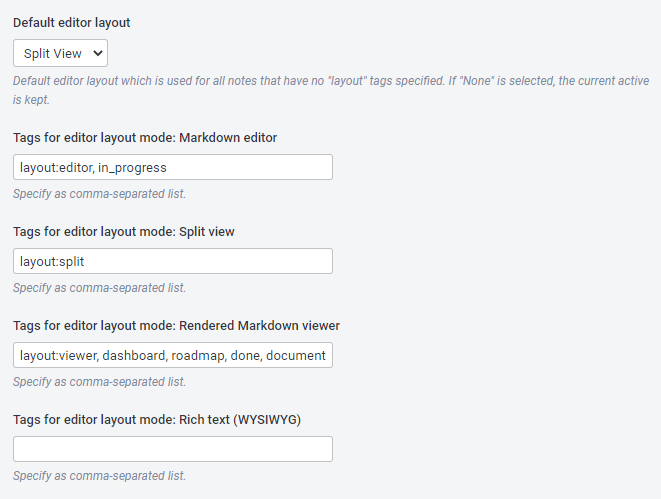

# Joplin Persistent Editor Layout

Persistent Editor Layout is a plugin to extend the UX of [Joplin's](https://joplinapp.org/) desktop application.

It allows to persist the editor layout for each note separately with [custom tags](#usage).

> :warning: **CAUTION** - Requires Joplin **v1.7.4** or newer

## Features

- Persist the editor layout (`editor / split view / viewer / rich text`) for each note separately
- Ability to specify [custom tags](#usage) to force a specific layout
- Persisted layout is synced across (desktop) devices, if the plugin is installed

## Installation

### Automatic (Joplin v1.6.4 and newer)

- Open Joplin and navigate to `Tools > Options > Plugins`
- Search for the plugin name and press install
- Restart Joplin to enable the plugin

### Manual

- Download the latest released JPL package (`*.jpl`) from [here](https://github.com/benji300/joplin-persistent-layout/releases)
- Open Joplin and navigate to `Tools > Options > Plugins`
- Press `Install plugin` and select the previously downloaded `jpl` file
- Confirm selection
- Restart Joplin to enable the plugin

### Uninstall

- Open Joplin and navigate to `Tools > Options > Plugins`
- Search for the plugin name and press `Delete` to remove the plugin completely
  - Alternatively you can also disable the plugin by clicking on the toggle button
- Restart Joplin

## Usage

To persist the layout for a note follow these steps:

1. Specify the tags for which a specific layout should be used.

   - To do this, go to the plugin's settings/options page and add the tags to the settings.

   - An example configuration could like this:

     

1. Make sure that the correct value is selected in `View > Layout button sequence`.

   - To be able to use the layout switching correctly, this setting must be set accordingly. Otherwise the editor layout might not be switched to the expected one.

   - For example: If a tag is specified in option `Tags for editor layout mode: Rendered Markdown viewer` and least one note uses it, the setting must also contain `Viewer`.

1. Add the appropriate tags to the notes. If not already done.

   - When the selected note is changed, the editor layout is switched.

   - If none of the selected note's tags matches a specified layout tag, the default layout from the option `Default editor layout` is used.

     - If nothing is selected as default editor layout, the currently active editor layout will be kept.

   - If more than one tag is specified for a note, the first matching one is used.

## Commands

This plugin does not provide any commands.

## User options

This plugin adds provides user options which can be changed via `Tools > Options > Persistent Layout` (Windows App).

## Feedback

- :question: Need help?
  - Ask a question on the [Joplin Forum](https://discourse.joplinapp.org/t/persist-editor-layout-plugin/14411)
- :bulb: An idea to improve or enhance the plugin?
  - Start a new discussion on the [Forum](https://discourse.joplinapp.org/t/persist-editor-layout-plugin/14411) or upvote [popular feature requests](https://github.com/benji300/joplin-persistent-layout/issues?q=is%3Aissue+is%3Aopen+label%3Aenhancement+sort%3Areactions-%2B1-desc+)
- :bug: Found a bug?
  - Check the [Forum](https://discourse.joplinapp.org/t/persist-editor-layout-plugin/14411) if anyone else already reported the same issue. Otherwise report it by yourself.

## Support

You like this plugin as much as I do and it improves your daily work with Joplin?

Then I would be very happy if you buy me a :beer: or :coffee: via [PayPal](https://www.paypal.com/donate?hosted_button_id=6FHDGK3PTNU22) :wink:

## Development

The npm package of the plugin can be found [here](https://www.npmjs.com/package/joplin-plugin-persistent-editor-layout).

### Building the plugin

If you want to build the plugin by your own simply run `npm run dist`.

### Updating the plugin framework

To update the plugin framework, run `npm run update`.

## Changes

See [CHANGELOG](./CHANGELOG.md) for details.

## License

Copyright (c) 2021 Benjamin Seifert

MIT License. See [LICENSE](./LICENSE) for more information.
